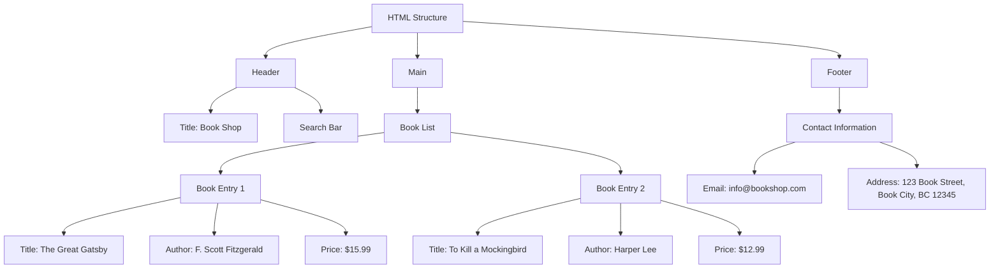

# Book Shop Webpage Plan

## 1. HTML Structure
```html
<!DOCTYPE html>
<html lang="en">
<head>
    <meta charset="UTF-8">
    <meta name="viewport" content="width=device-width, initial-scale=1.0">
    <title>Book Shop</title>
    <link rel="stylesheet" href="styles.css">
</head>
<body>
    <header>
        <h1>Book Shop</h1>
        <input type="text" id="search-bar" placeholder="Search for books...">
    </header>
    <main>
        <ul id="book-list">
            <!-- Example book entries -->
            <li>
                <h2>The Great Gatsby</h2>
                <p>Author: F. Scott Fitzgerald</p>
                <p>Price: $15.99</p>
            </li>
            <li>
                <h2>To Kill a Mockingbird</h2>
                <p>Author: Harper Lee</p>
                <p>Price: $12.99</p>
            </li>
            <!-- More book entries can be added here -->
        </ul>
    </main>
    <footer>
        <p>Contact us at <a href="mailto:info@bookshop.com">info@bookshop.com</a></p>
        <p>Address: 123 Book Street, Book City, BC 12345</p>
    </footer>
</body>
</html>
```

## 2. CSS Design
```css
/* styles.css */
body {
    font-family: Arial, sans-serif;
    margin: 0;
    padding: 0;
    background-color: #f4f4f4;
}

header {
    background-color: #333;
    color: #fff;
    padding: 10px 20px;
    text-align: center;
}

header h1 {
    margin: 0;
}

#search-bar {
    width: 100%;
    padding: 10px;
    margin-top: 10px;
    border: 1px solid #ccc;
    border-radius: 5px;
}

main {
    max-width: 800px;
    margin: 20px auto;
    padding: 20px;
    background-color: #fff;
    box-shadow: 0 0 10px rgba(0, 0, 0, 0.1);
}

#book-list {
    list-style-type: none;
    padding: 0;
}

#book-list li {
    margin-bottom: 20px;
    padding: 10px;
    border: 1px solid #ddd;
    border-radius: 5px;
    background-color: #fff;
}

#book-list h2 {
    margin: 0 0 10px;
}

#book-list p {
    margin: 0;
}

footer {
    background-color: #333;
    color: #fff;
    text-align: center;
    padding: 10px 20px;
    position: fixed;
    bottom: 0;
    width: 100%;
}

footer p {
    margin: 0;
    padding: 5px 0;
}
```

## 3. Mermaid Diagram


## 4. Summary
- **HTML**: The structure includes a header with a title and a search bar, a main section with a list of books, and a footer with contact information.
- **CSS**: The design includes a clean and modern look with a simple color scheme and basic styling for the header, search bar, book list, and footer.